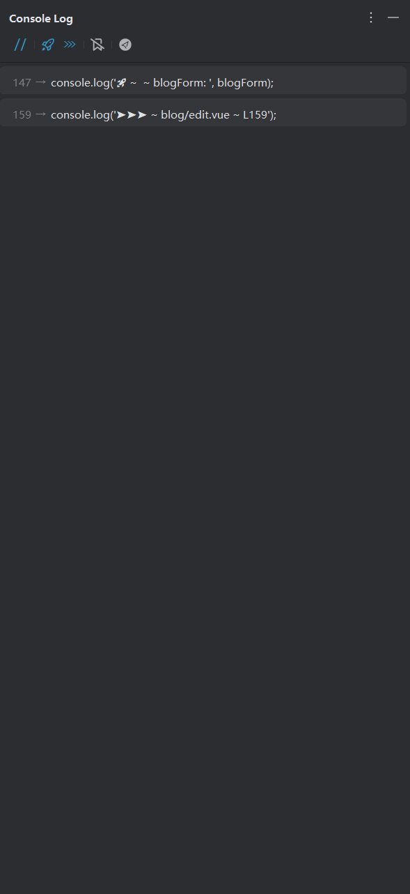

# Console Log README

<!-- Plugin description -->
**ConsoleLog**能够通过光标所在位置快速打印console.log语句，并在结束调试后一键删除  
更适用于WebStorm和IDEA的前端开发插件

默认的快捷键：
- Alt+1: 插入 console.log()
- Alt+2: 删除所有 console.log()
- Alt+Shift+1: 注释掉所有 console.log()
- Alt+Shift+2: 解注释所有 console.log()

键盘映射名称：
- Alt+1: Console Log Plugin: Insert Console Log Message
- Alt+2: Console Log Plugin: Delete All Console Log Message
- Alt+Shift+1: Console Log Plugin: Comment All Console Log Message
- Alt+Shift+2: Console Log Plugin: Uncomment Console Log Message

### 已发布功能
- [x] 哈喽，你可以通过WebStorm的插件设置自定义你的打印模板哦，但是要注意尽量与众不同一点哦，不然可能会误删你不想删掉的console.log语句哦
- [x] 智能地插入打印语句，包智能的，嘿嘿🤭
- [x] 可以在插件设置中自行设置插入打印语句后光标是否自动跟随到打印语句末尾（默认启用）
- [x] 可以在插件设置中自行设置字符串使用双引号还是单引号包含（默认启用双引号）
- [x] 存在选中文本时（支持多光标区域选中）仅在选中区域内删除/注释/解注释（默认启用）
- [x] 除了单引号/双引号，加入反引号(`)的支持
- [x] 可以在插件设置中自行设置是否启用侧边栏，侧边栏显示当前打开文件的所有打印表达式（默认启用）
- [x] 侧边栏支持点击定位到对应行的打印语句
- [x] 侧边栏支持查询 所有打印表达式/不包含注释的打印表达式/仅符合插件规范格式的打印表达式

> 可在[github](https://github.com/Littledogdudu/ConsoleLog/releases)或者[jetbrain marketplace](https://plugins.jetbrains.com/plugin/26574-console-log/versions)上下载对应心仪版本  
> 1.0.6版本是插件最主要功能的最佳版本，是没有加入多光标支持、选中区域删除/注释/解注释和侧边栏的版本  
> 1.1.3版本是当前加入多光标支持和选中区域删除/注释/解注释功能的最佳版本（推荐）  
> 1.2.0版本是当前加入侧边栏的支持的最佳版本

运行这个插件需要把这个local方法的参数修改为你的WebStorm文件路径哦

抱歉，暂时不完全支持jsp项目（注释和解注释无法使用），该插件插入时可能只能插入在下一行，在没有语法错误的情况下，删除理论可以使用

### 感谢列表
- 由igor.pavlenko提出PSI JS类型强制转换问题的bug
- 由yan.wt提出新的功能：支持在格式化字符串中添加文件名和行号

> 灵感来源于vscode插件 [turbo console log](https://github.com/Chakroun-Anas/turbo-console-log)  
> 有新的主意可以在[github](https://github.com/Littledogdudu/ConsoleLog)上fork或提出[issue](https://github.com/Littledogdudu/ConsoleLog/issues)或者发送到我的邮箱2378459785@qq.com哦  
> 如果觉得插件对你的帮助很大很大，希望[github点个star](https://github.com/Littledogdudu/ConsoleLog)，真的感谢！

# 设置项简介

## 基础设置
### 插入语句
你可以通过输入下面【符号】列对应的占位符来实时获取文本中对应的变量名/方法名/行号/文件名  
例如默认为：🚀 ~ \${methodName} ~ \${variableName}:&nbsp;  
你可以修改为：🚀 ~ \${fileName} ~ L(\${lineNumber}) ~ \${methodName} ~ \${variableName}:&nbsp;
### 是否使用打印变量所在行号
默认不启用：\${lineNumber}占位符将会被替换为生成的console.log所在的行号  
启用后：\${lineNumber}占位符会被替换为需要打印的变量所在的行号
### 打印的文件名是否需要后缀名
默认启用：\${fileName}占位符将会被替换为生成的console.log所在的文件名，且包含后缀名  
禁用后：\${fileName}占位符将会被替换为生成的console.log所在的文件名，但不在包含后缀名
### 选中文本时仅在选中区域内删除/注释/解注释
默认启用：当选中文本时，删除/注释/解注释功能将仅在选中区域内生效  
禁用后：无论是否选中文本，删除/注释/解注释功能都会在整个文件内生效

## 格式设置
### 插入后光标后自动跟随到log表达式末尾
默认启用：插入后光标自动跟随到生成的console.log表达式末尾
禁用后：光标停留在原本位置
### 使用单引号/双引号/反引号
单选组，更改包裹console.log表达式文本所使用的引号类型

## 侧边栏设置

### 侧边栏顶部查询选项设置按钮
#### 展示/隐藏注释项（眼睛图标）
启用后：侧边栏将查询所有打印表达式，包含注释项
默认禁用：侧边栏将查询所有打印表达式，不包含注释项
#### 启用/禁用针对性查找（小火箭图标/禁用图标）
启用后：侧边栏将查询所有符合插件生成规范的打印表达式
默认禁用：侧边栏将查询所有console.log表达式
#### 启用/禁用标签查找（书签图标）
启用后：根据设置中设置的标签项继续查找，标签项为1级，表达式为2级（缩进2字符）
禁用后：禁用标签查找

### 是否启用侧边栏（重启生效）
默认启用：启用侧边栏
禁用后：禁用侧边栏
### 侧边栏查找不限定文件类型
默认启用：对当前打开的任何文件类型的文件都会启用侧边栏查找打印表达式
禁用后：仅对当前打开的文件为选中文件类型的文件才会执行查找并显示在侧边栏
### 侧边栏字体大小
用来自定义设置侧边栏字体大小
### 首次启动侧边栏时是否默认启用标签查找
启用后：每次打开IDE时，侧边栏将默认启用侧边栏标签查找（标签项在下面的设置项可以进行设置）
默认禁用：侧边栏不会默认启用标签查找（也可通过侧边栏顶部的【启用标签查找】临时更改）
### 侧边栏自定义标签查询项
自定义侧边栏查找的标签项，使用分号分割每个标签项，支持正则表达式

---

**ConsoleLog** can quickly print console.log() in your code and free-hand

Default keymap as following:
- Alt+1: Console Log Plugin: Insert Console Log Message
- Alt+2: Console Log Plugin: Delete All Console Log Message
- Alt+Shift+1: Console Log Plugin: Comment All Console Log Message
- Alt+Shift+2: Console Log Plugin: Uncomment Console Log Message

- [x] you can go to settings to set what message you want to show
- [x] Intelligently insert print statements, hei hei 🤭
- [x] You can set whether the cursor automatically follows to the end of the print statement after inserting the print statement in the plug-in settings (enabled by default)
- [x] You can set whether the string is included in double or single quotes in the plugin settings (double quotes are enabled by default)
- [x] When selecting Chinese book, delete annotation only in the selected area (enabled by default)
- [x] In addition to single and double quotation marks, support for backticks (') has been added
- [x] You can set whether to enable the sidebar in the plug-in settings, and the sidebar displays all print expressions of the currently open file (enabled by default)
- [x] The sidebar supports clicking on the print statement that is located to the corresponding line
- [x] The sidebar supports queries All print expressions that do not contain comments are only in the format of the plug-in specification

if you want to run this project, please modify the local path.

Sorry, jsp not support  
You can use the plugin on html code, but be careful: the statement is not removed if there is a syntax error after inserting the expression, because the PSI tree structure is chaotic at this point

### Thanks List
- Bug report on PSI JS type coercion issue by igor.pavlenko
- New feature proposed by yan.wt: support for adding file names and line numbers in formatted strings

> The idea from vscode plugin [turbo console log](https://github.com/Chakroun-Anas/turbo-console-log)

# Setting description

## Basic Setting
### Insert Sentence
You can obtain the corresponding variable name/method name/line number/file name in real-time in the text by entering the placeholder corresponding to the symbol column below  
For example, the default is: 🚀 ~ \$ {methodName} ~ \${variableName}:&nbsp;  
You can modify it to: 🚀 ~ \$ {fileName} ~ L(\${lineNumber}) ~ \${methodName} ~ \${variableName}:&nbsp;
### Whether to use the line number where the print variable is located
Default not enabled: The \${lineNumber} placeholder will be replaced with the line number where the generated console.log is located  
After activation, the \${lineNumber} placeholder will be replaced with the line number of the variable that needs to be printed
### whether the file name of the print needs a suffix
Default enabled: The \${fileName} placeholder will be replaced with the file name of the generated console.log, including the suffix  
After disabling: The \${fileName} placeholder will be replaced with the file name of the generated console.log, but it will not include the suffix
### when selecting code text, it will be deleted/comment/uncomment only within the selected area
Default enabled: When selecting text, the delete/comment/uncomment function will only take effect within the selected area  
After disabling: Regardless of whether text is selected or not, the delete/comment/uncomment function will take effect throughout the entire file

## Format Setting
### after insertion, the cursor automatically follows to the end of the log expression
Default enabled: After insertion, the cursor automatically follows to the end of the generated console.log expression  
After disabling: the cursor stays in its original position
### single quotes/double quotes/back tick
radio group to change the type of quotation marks used to wrap console.log expression text

## Sidebar Setting

### Query option settings button at the top of the sidebar
#### show/hidden comment (eye icon)
When enabled: The sidebar will query all print expressions, including comment items  
Disabled by default: The sidebar will query all print expressions and do not contain comment items
#### enable/disable targeted lookup (rocket/disable icon)
When enabled: The sidebar will query all print expressions that meet the plugin's generation specifications  
Disabled by default: The sidebar will query all console.log expressions
#### enable/disable tag lookup (bookmark icon)
Enabled: Continue to search according to the label items set in the settings, the label item is level 1, and the expression is level 2 (indented 2 characters)  
Disabled: Disables tag lookup

### whether to enable the sidebar (restart takes effect)
Enabled by default: Enables the sidebar  
After disabled: Disable the sidebar
### sidebar lookup is not limited to file types
Enabled by default: Enables sidebar lookup for print expressions for any file type that is currently open  
After disabled: Only files that are currently open and of the Chinese file type are searched and displayed in the sidebar
### sidebar font size
Used to customize the sidebar font size
### label lookup is enabled by default when you first launch the sidebar
Enabled: Every time you open the IDE, the sidebar will enable sidebar label lookup by default (the label items can be set in the settings below items)  
Disabled by default: The sidebar does not enable tag lookup by default (it can also be temporarily changed via Enable Tag Lookup at the top of the sidebar)
### sidebar custom label query items
Customize the tag items found in the sidebar, use semicolons to split each tag item, and support regular expressions  
<!-- Plugin description end -->