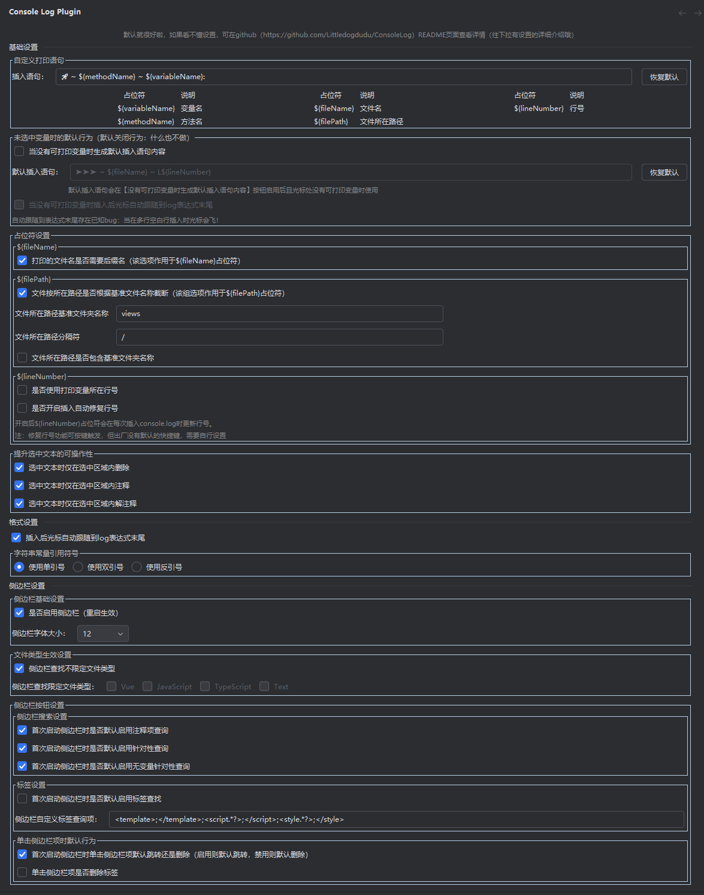

# Console Log README

<!-- Plugin description -->
**ConsoleLog**能够通过光标所在位置快速打印console.log语句，并在结束调试后一键删除

默认的快捷键：
- Alt+1: 插入 console.log()
- Alt+2: 删除所有 console.log()
- Alt+Shift+1: 注释掉所有 console.log()
- Alt+Shift+2: 解注释所有 console.log()

键盘映射名称：
- Alt+1: Console Log Plugin: Insert Console Log Message
- Alt+2: Console Log Plugin: Delete All Console Log Message
- Alt+Shift+1: Console Log Plugin: Comment All Console Log Message
- Alt+Shift+2: Console Log Plugin: Uncomment Console Log Message

### 已发布功能
- [x] 哈喽，你可以通过WebStorm的插件设置自定义你的打印模板哦，但是要注意尽量与众不同一点哦，不然可能会误删你不想删掉的console.log语句哦
- [x] 智能地插入打印语句，包智能的，嘿嘿🤭
- [x] 可以在插件设置中自行设置插入打印语句后光标是否自动跟随到打印语句末尾（默认启用）
- [x] 可以在插件设置中自行设置字符串使用双引号还是单引号包含（默认启用双引号）
- [x] 存在选中文本时（支持多光标区域选中）仅在选中区域内删除/注释/解注释（默认启用）
- [x] 除了单引号/双引号，加入反引号(`)的支持
- [x] 不选中文本时生成判断数据流向的语句及删除/注释/解注释的行为

### 未发布功能（feature-sider分支尚未合并）
- [ ] 可以在插件设置中自行设置是否启用侧边栏，侧边栏显示当前打开文件的所有打印表达式（默认启用）
- [ ] 侧边栏支持点击定位到对应行的打印语句
- [ ] 侧边栏支持查询 所有打印表达式/不包含注释的打印表达式/仅符合插件规范格式的打印表达式

> 可在[github](https://github.com/Littledogdudu/ConsoleLog/releases)或者[jetbrain marketplace](https://plugins.jetbrains.com/plugin/26574-console-log/versions)上下载对应心仪版本  
> 1.0.6版本是插件最主要功能的最佳版本，是没有加入多光标支持、选中区域删除/注释/解注释和侧边栏的版本  
> 1.1.3版本是当前加入多光标支持和选中区域删除/注释/解注释功能的最佳版本（推荐）  
> 1.2.0版本是当前加入侧边栏的支持的最佳版本

运行这个插件需要把这个local方法的参数修改为你的WebStorm文件路径哦

抱歉，暂时不完全支持jsp项目（注释和解注释无法使用），该插件插入时可能只能插入在下一行，在没有语法错误的情况下，删除理论可以使用

### 感谢列表
- 由igor.pavlenko提出PSI JS类型强制转换问题的bug
- 由yan.wt提出新的功能：支持在格式化字符串中添加文件名和行号
- 由JiGewusuoweiju提出新的功能：期望未选中文本的时候，依然可以打印默认信息

> 灵感来源于vscode插件 [turbo console log](https://github.com/Chakroun-Anas/turbo-console-log)  
> 有新的主意可以在[github](https://github.com/Littledogdudu/ConsoleLog)上fork或提出[issue](https://github.com/Littledogdudu/ConsoleLog/issues)或者发送到我的邮箱2378459785@qq.com哦  
> 如果觉得插件对你的帮助很大很大，希望[github点个star](https://github.com/Littledogdudu/ConsoleLog)，真的感谢！

# 设置项简介

## 基础设置
### 插入语句
你可以通过输入下面【符号】列对应的占位符来实时获取文本中对应的变量名/方法名/行号/文件名  
例如默认为：🚀 ~ \${methodName} ~ \${variableName}:&nbsp;  
你可以修改为：🚀 ~ \${fileName} ~ L(\${lineNumber}) ~ \${methodName} ~ \${variableName}:&nbsp;
### 是否使用打印变量所在行号
默认不启用：\${lineNumber}占位符将会被替换为生成的console.log所在的行号  
启用后：\${lineNumber}占位符会被替换为需要打印的变量所在的行号
### 打印的文件名是否需要后缀名
默认启用：\${fileName}占位符将会被替换为生成的console.log所在的文件名，且包含后缀名  
禁用后：\${fileName}占位符将会被替换为生成的console.log所在的文件名，但不在包含后缀名
### 选中文本时仅在选中区域内删除/注释/解注释
默认启用：当选中文本时，删除/注释/解注释功能将仅在选中区域内生效  
禁用后：无论是否选中文本，删除/注释/解注释功能都会在整个文件内生效
## 格式设置
### 插入后光标后自动跟随到log表达式末尾
默认启用：插入后光标自动跟随到生成的console.log表达式末尾
禁用后：光标停留在原本位置
### 是否使用双引号
默认启用：插入后生成的console.log表达式使用双引号包含
禁用后：插入后生成的console.log表达式使用单引号包含

---

**ConsoleLog** can quickly print console.log() in your code and free-hand

Default keymap as following:
- Alt+1: Console Log Plugin: Insert Console Log Message
- Alt+2: Console Log Plugin: Delete All Console Log Message
- Alt+Shift+1: Console Log Plugin: Comment All Console Log Message
- Alt+Shift+2: Console Log Plugin: Uncomment Console Log Message

- [x] you can go to settings to set what message you want to show
- [x] Intelligently insert print statements, hei hei 🤭
- [x] You can set whether the cursor automatically follows to the end of the print statement after inserting the print statement in the plug-in settings (enabled by default)
- [x] You can set whether the string is included in double or single quotes in the plugin settings (double quotes are enabled by default)
- [x] When selecting Chinese book, delete annotation only in the selected area (enabled by default)
- [x] In addition to single and double quotation marks, support for backticks (') has been added
- [x] When the variable is undefined near the cursor, a statement that determines the direction of data flow is generated, and the act of deleting/commenting/uncommenting is generated

Unreleased features
- [ ] You can set whether to enable the sidebar in the plug-in settings, and the sidebar displays all print expressions of the currently open file (enabled by default)
- [ ] The sidebar supports clicking on the print statement that is located to the corresponding line
- [ ] The sidebar supports queries All print expressions that do not contain comments are only in the format of the plug-in specification

if you want to run this project, please modify the local path.

Sorry, jsp not support  
You can use the plugin on html code, but be careful: the statement is not removed if there is a syntax error after inserting the expression, because the PSI tree structure is chaotic at this point

### Thanks List
- Bug report on PSI JS type coercion issue by igor.pavlenko
- New feature proposed by yan.wt: support for adding file names and line numbers in formatted strings
- New feature proposed by JiGewusuoweiju: When the variable is undefined near the cursor, a statement that determines the direction of data flow is generated, and the act of deleting/commenting/uncommenting is generated

> The idea from vscode plugin [turbo console log](https://github.com/Chakroun-Anas/turbo-console-log)

# Setting description

## 基础设置
### 插入语句
You can obtain the corresponding variable name/method name/line number/file name in real-time in the text by entering the placeholder corresponding to the symbol column below  
For example, the default is: 🚀 ~ \$ {methodName} ~ \${variableName}:&nbsp;  
You can modify it to: 🚀 ~ \$ {fileName} ~ L(\${lineNumber}) ~ \${methodName} ~ \${variableName}:&nbsp;
### 是否使用打印变量所在行号
Default not enabled: The \${lineNumber} placeholder will be replaced with the line number where the generated console.log is located  
After activation, the \${lineNumber} placeholder will be replaced with the line number of the variable that needs to be printed
### 打印的文件名是否需要后缀名
Default enabled: The \${fileName} placeholder will be replaced with the file name of the generated console.log, including the suffix  
After disabling: The \${fileName} placeholder will be replaced with the file name of the generated console.log, but it will not include the suffix
### 选中文本时仅在选中区域内删除/注释/解注释
Default enabled: When selecting text, the delete/comment/uncomment function will only take effect within the selected area  
After disabling: Regardless of whether text is selected or not, the delete/comment/uncomment function will take effect throughout the entire file
## 格式设置
### 插入后光标后自动跟随到log表达式末尾
Default enabled: After insertion, the cursor automatically follows to the end of the generated console.log expression  
After disabling: the cursor stays in its original position
### 是否使用双引号
Default enabled: The console.log expression generated after insertion is enclosed in double quotation marks  
After disabling: The console.log expression generated after insertion is enclosed in single quotation marks 
<!-- Plugin description end -->