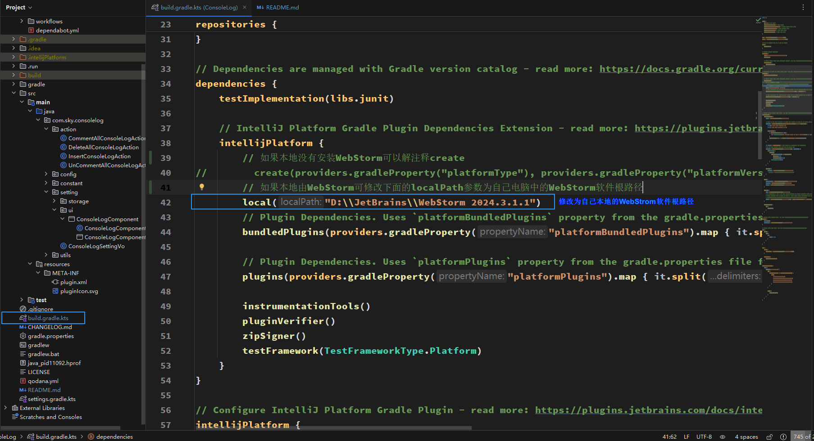

# Console Log README
- zh_CN [简体中文](./README.md)
- en_US [English](./README.en_US.md)

<!-- Plugin description -->
**ConsoleLog**能够通过光标所在位置快速打印console.log语句，并在结束调试后一键删除

默认的快捷键：
- Alt+1: 插入 console.log()
- Alt+2: 删除所有 console.log()
- Alt+Shift+1: 注释掉所有 console.log()
- Alt+Shift+2: 解注释所有 console.log()

- [x] 哈喽，你可以通过WebStorm的插件设置自定义你的打印模板哦，但是要注意尽量与众不同一点哦，不然可能会误删你不想删掉的console.log语句哦

运行这个插件需要把这个local方法的参数修改为你的WebStorm文件路径哦

> 灵感来源于vscode插件 [turbo console log](https://github.com/Chakroun-Anas/turbo-console-log)  
> 有新的主意可以在github上fork或提出issue或者发送到我的邮箱2378459785@qq.com哦
<!-- Plugin description end -->