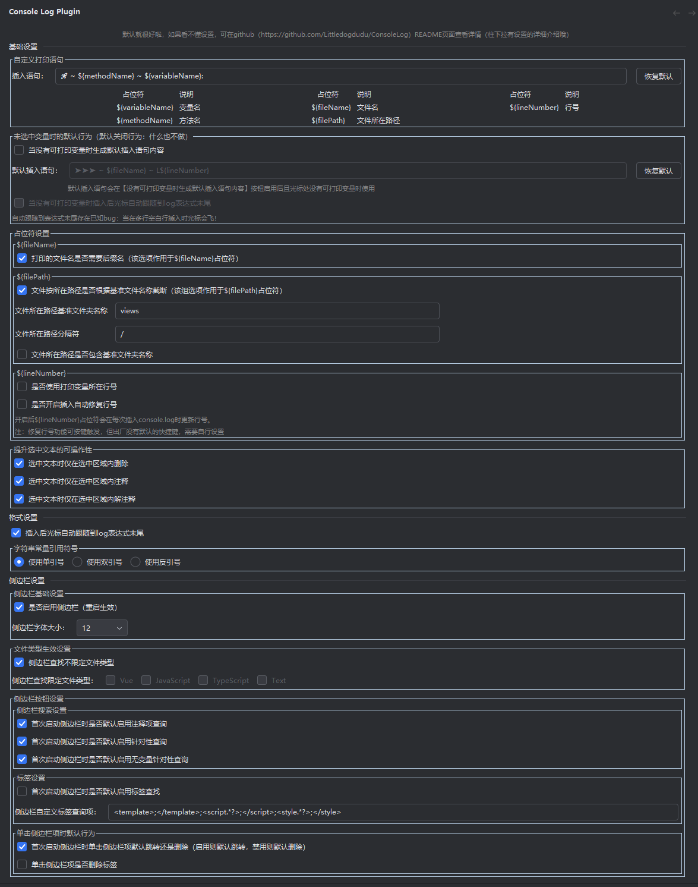

# Console Log README

**ConsoleLog**能够通过光标所在位置快速打印console.log语句，并在结束调试后一键删除  
更适用于WebStorm和IDEA的前端开发插件

默认的快捷键：
- Alt+1: 插入 console.log()
- Alt+2: 删除所有 console.log()
- Alt+Shift+1: 注释掉所有 console.log()
- Alt+Shift+2: 解注释所有 console.log()

键盘映射名称：
- Alt+1: Console Log Plugin: Insert Console Log Message
- Alt+2: Console Log Plugin: Delete All Console Log Message
- Alt+Shift+1: Console Log Plugin: Comment All Console Log Message
- Alt+Shift+2: Console Log Plugin: Uncomment Console Log Message

### 已发布功能
#### 基础功能
- [x] 哈喽，你可以通过WebStorm的插件设置自定义你的打印模板哦，但是要注意尽量与众不同一点哦，不然可能会误删你不想删掉的console.log语句哦
- [x] 智能地插入打印语句，包智能的，嘿嘿🤭
- [x] 可以在插件设置中自行设置插入打印语句后光标是否自动跟随到打印语句末尾（默认启用）
- [x] 可以在插件设置中自行设置字符串使用双引号还是单引号包含（默认启用双引号）
- [x] 存在选中文本时（支持多光标区域选中）仅在选中区域内删除/注释/解注释（默认启用）
- [x] 除了单引号/双引号，加入反引号(`)的支持

#### 无变量打印功能（默认不启用）
- [x] 不选中文本时生成判断数据流向的语句及删除/注释/解注释的行为
- [x] 插入后自动修复行号（为避免过分的性能开销，后续也不会再扩展，比如删除时，代码变更时）
- [x] 提供修复行号功能（不默认设置快捷键，需要自行设置）

#### 侧边栏功能
- [x] 可以在插件设置中自行设置是否启用侧边栏，侧边栏显示当前打开文件的所有打印表达式（默认启用）
- [x] 侧边栏支持点击定位到对应行的打印语句
- [x] 侧边栏支持查询 所有打印表达式/不包含注释的打印表达式/仅符合插件规范格式的打印表达式

> 可在[github](https://github.com/Littledogdudu/ConsoleLog/releases)或者[jetbrain marketplace](https://plugins.jetbrains.com/plugin/26574-console-log/versions)上下载对应心仪版本  
> 1.0.6版本是插件最主要功能的最佳版本，是没有加入多光标支持、选中区域删除/注释/解注释和侧边栏的版本  
> 1.1.5版本是当前加入多光标支持和选中区域删除/注释/解注释功能的最佳版本（推荐）  
> 1.2.1版本是当前加入侧边栏的支持的最佳版本

### 开发者
环境配置：JDK17和Gradle8.10  
运行这个插件需要把这个local方法的参数修改为你的WebStorm文件路径哦
  
在一些网络下，gradle下载依赖可能出现失败的情况，

抱歉，暂时**不完全**支持jsp项目（注释和解注释无法使用），该插件插入时可能只能插入在下一行，在没有语法错误的情况下，删除理论可以使用

### 鸣谢
- 由igor.pavlenko提出PSI JS类型强制转换问题的bug
- 由yan.wt提出新的功能：支持在格式化字符串中添加文件名和行号
- 由JiGewusuoweiju提出新的功能：期望未选中文本的时候，依然可以打印默认信息

> 灵感来源于vscode插件 [turbo console log](https://github.com/Chakroun-Anas/turbo-console-log)  
> 有新的主意可以在[github](https://github.com/Littledogdudu/ConsoleLog)上fork或提出[issue](https://github.com/Littledogdudu/ConsoleLog/issues)或者发送到我的邮箱2378459785@qq.com哦  
> 如果觉得插件对你的帮助很大很大，希望[github点个star](https://github.com/Littledogdudu/ConsoleLog)，真的感谢！

# 设置项简介

## 基础设置
### 自定义打印语句

#### 插入语句

你可以通过输入下面【符号】列对应的占位符来实时获取文本中对应的变量名/方法名/行号/文件名  
例如默认为：🚀 ~ \${methodName} ~ \${variableName}:&nbsp;  
你可以修改为：🚀 ~ \${filePath}/${fileName} ~ L(\${lineNumber}) ~ \${methodName} ~ \${variableName}:&nbsp;

### 未选中变量时的默认行为（默认关闭行为：什么也不做）

#### 当没有可打印变量时生成默认插入语句内容

默认不启用：当光标处没有可打印变量时，什么也不做  
启用后：当光标处没有可打印变量时，插入的打印语句将使用下方填写的默认插入语句模板

#### 默认插入语句

同插入语句，但是仅在启用上方的【当没有可打印变量是生成默认插入语句内容】按钮且当前光标没有可打印变量时调用

#### 当没有可打印变量时插入后光标自动跟随到log表达式末尾

默认不启用（建议）：当没有可打印变量时，插入的打印语句将自动跟随到生成的console.log的末尾  
启用后：插入的打印语句将自动跟随到生成的console.log的末尾

> 已知bug：当光标上方存在多行空行时使用此功能不仅会删除多余的空行，而且会导致打印的行号停留在光标之前的行，因为代码格式化导致的删除的关系，这个行号不正确

### 占位符设置

#### ${fileName}

#### 打印的文件名是否需要后缀名

默认启用：\${fileName}占位符将会被替换为生成的console.log所在的文件名，且包含后缀名  
禁用后：\${fileName}占位符将会被替换为生成的console.log所在的文件名，但不在包含后缀名

#### ${filePath}

##### 文件所在路径是否根据基准文件名称截断

默认启用：\${filePath}占位符将会被替换为生成的console.log所在文件的相对路径，且根据【文件所在路径基准文件夹名称】截断
禁用后：\${filePath}占位符将会被替换为生成的console.log所在文件相对路径

##### 文件所在路径基准文件夹名称

默认为views：即\${filePath}占位符将会根据填写内容截断  
例如：当前所在相对路径为 src/views/blog/index.vue，则根据views截断后获得：blog/index.vue

多个文件夹名称可通过逗号分隔

##### 文件所在路径是否包含基准文件夹名称

默认启用：当前所在相对路径为 src/views/blog/index.vue，则根据views截断后获得：views/blog/index.vue
禁用后：当前所在相对路径为 src/views/blog/index.vue，则根据views截断后获得：blog/index.vue

#### ${lineNumber}

##### 是否使用打印变量所在行号

默认不启用：\${lineNumber}占位符将会被替换为生成的console.log所在的行号  
启用后：\${lineNumber}占位符会被替换为需要打印的变量所在的行号

##### 是否开启插入自动修复行号

默认不启用：\${lineNumber}占位符不会自动更新，需手动更新  
启用后：\${lineNumber}占位符会在插入console.log语句时自动更新为正确行号

### 提升选中文本时的可操作性

#### 选中文本时仅在选中区域内删除/注释/解注释

默认启用：当选中文本时，删除/注释/解注释功能将仅在选中区域内生效  
禁用后：无论是否选中文本，删除/注释/解注释功能都会在整个文件内生效

## 格式设置

### 插入后光标后自动跟随到log表达式末尾

默认启用：插入后光标自动跟随到生成的console.log表达式末尾  
禁用后：光标停留在原本位置

### 字符串常量引用符号

#### 使用单引号/双引号/反引号

单选组，更改包裹console.log表达式文本所使用的引号类型

---

<!-- Plugin description -->

**ConsoleLog** can quickly print console.log() in your code and free-hand

Default keymap as following:
- Alt+1: Console Log Plugin: Insert Console Log Message
- Alt+2: Console Log Plugin: Delete All Console Log Message
- Alt+Shift+1: Console Log Plugin: Comment All Console Log Message
- Alt+Shift+2: Console Log Plugin: Uncomment Console Log Message

### Release Feature
#### basic feature
- [x] you can go to settings to set what message you want to show
- [x] Intelligently insert print statements, hei hei 🤭
- [x] You can set whether the cursor automatically follows to the end of the print statement after inserting the print statement in the plug-in settings (enabled by default)
- [x] You can set whether the string is included in double or single quotes in the plugin settings (double quotes are enabled by default)
- [x] When selecting Chinese book, delete annotation only in the selected area (enabled by default)
- [x] In addition to single and double quotation marks, support for backticks (') has been added

#### no variable feature(disabled default)
- [x] When the variable is not selected, a statement that determines the direction of data flow is generated, and the act of deleting/commenting/uncommenting is generated
- [x] Automatically repairs line numbers after insertion (in order to avoid excessive performance overhead, they will not be extended in the future, such as when deleting or changing code)
- [x] Provide the function of repairing line numbers (shortcut keys are not set by default, you need to set them by yourself)

#### sidebar feature
- [x] You can set whether to enable the sidebar in the plug-in settings, and the sidebar displays all print expressions of the currently open file (enabled by default)
- [x] The sidebar supports clicking on the print statement that is located to the corresponding line
- [x] The sidebar supports queries All print expressions that do not contain comments are only in the format of the plug-in specification

if you want to run this project, please modify the local path.

Sorry, jsp not support  
You can use the plugin on html code, but be careful: the statement is not removed if there is a syntax error after inserting the expression, because the PSI tree structure is chaotic at this point

### Thanks List
- Bug report on PSI JS type coercion issue by igor.pavlenko
- New feature proposed by yan.wt: support for adding file names and line numbers in formatted strings
- New feature proposed by JiGewusuoweiju: When the variable is undefined near the cursor, a statement that determines the direction of data flow is generated, and the act of deleting/commenting/uncommenting is generated

> The idea from vscode plugin [turbo console log](https://github.com/Chakroun-Anas/turbo-console-log)

# Setting description

## Basic Setting
### custom print sentence

#### Insert Sentence
You can obtain the corresponding variable name/method name/line number/file name in real-time in the text by entering the placeholder corresponding to the symbol column below  
For example, the default is: 🚀 ~ \$ {methodName} ~ \${variableName}:&nbsp;  
You can modify it to: 🚀 ~ \${filePath}/${fileName} ~ L(\${lineNumber}) ~ \${methodName} ~ \${variableName}:&nbsp;

### Default behavior when variable is unchecked (default off behavior: do nothing)

#### Generates default insert statement content when there are no printable variables

Default not enabled: Nothing is done when there are no printable variables at the cursor  
After activation: When there are no printable variables at the cursor, the inserted print statement will use the default insert statement template filled in below

#### Default Insert Sentence

The same as the insert statement, but only when the \[Generates default insert statement content when there are no printable variables\] button above is enabled and the current cursor has no printable variables

#### when there are no printable variables, the cursor automatically follows to the end of the log expression after insertion

Default not enabled (recommended): When there are no printable variables, the inserted print statement will automatically follow to the end of the generated console.log  
After activation: Inserted print statements are automatically followed to the end of the generated console.log

> Known bug: Using this function when there are multiple blank lines above the cursor will not only delete the extra blank lines, but also cause the printed line number to stay on the line before the cursor, which is incorrect due to the deletion caused by code formatting

### Placeholder settings

#### ${fileName}

##### whether the file name of the print needs a suffix

Default enabled: The \${fileName} placeholder will be replaced with the file name of the generated console.log, including the suffix  
After disabling: The \${fileName} placeholder will be replaced with the file name of the generated console.log, but it will not include the suffix

#### ${filePath}

##### Should the file path be truncated based on the reference file name

Default enabled: The ${filePath} placeholder will be replaced with the relative path of the file where the generated console.log is located, truncated according to the [Reference Folder Name for File Path]
If disabled: The ${filePath} placeholder will be replaced with the relative path of the file where the generated console.log is located

##### Reference folder name for file path

Default is 'views': The ${filePath} placeholder will be truncated based on the provided content
For example: If the current relative path is src/views/blog/index.vue, truncating based on 'views' will result in: blog/index.vue

Multiple folder names can be separated by commas

##### Should the file path include the reference folder name

Default enabled: If the current relative path is src/views/blog/index.vue, truncating based on 'views' will result in: views/blog/index.vue
If disabled: If the current relative path is src/views/blog/index.vue, truncating based on 'views' will result in: blog/index.vue

#### ${lineNumber}

##### whether to use the line number where the print variable is located

Default not enabled: The \${lineNumber} placeholder will be replaced with the line number where the generated console.log is located  
After activation, the \${lineNumber} placeholder will be replaced with the line number of the variable that needs to be printed

##### whether to enable the insertion of auto-repair line numbers

Default not enabled: The \${lineNumber} placeholder will not be automatically updated and needs to be updated manually
After activation: The \${lineNumber} placeholder is automatically updated to the correct line number when the console.log statement is inserted

### Improve the operability when selecting code

### when selecting code text, it will be deleted/comment/uncomment only within the selected area

Default enabled: When selecting text, the delete/comment/uncomment function will only take effect within the selected area  
After disabling: Regardless of whether text is selected or not, the delete/comment/uncomment function will take effect throughout the entire file

## Format Setting

### after insertion, the cursor automatically follows to the end of the log expression

Default enabled: After insertion, the cursor automatically follows to the end of the generated console.log expression  
After disabling: the cursor stays in its original position

### String constant reference symbols

#### single quotes/double quotes/back tick

radio group to change the type of quotation marks used to wrap console.log expression text

<!-- Plugin description end -->